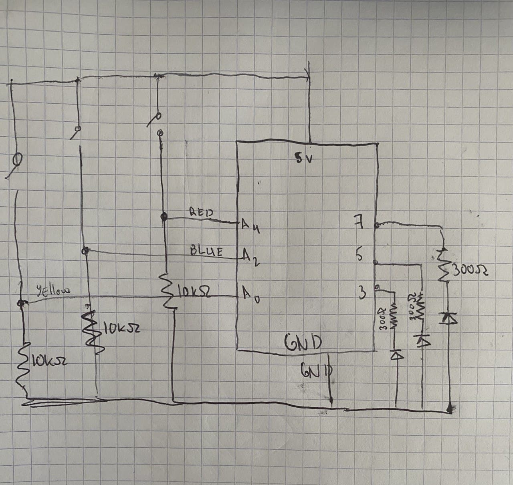
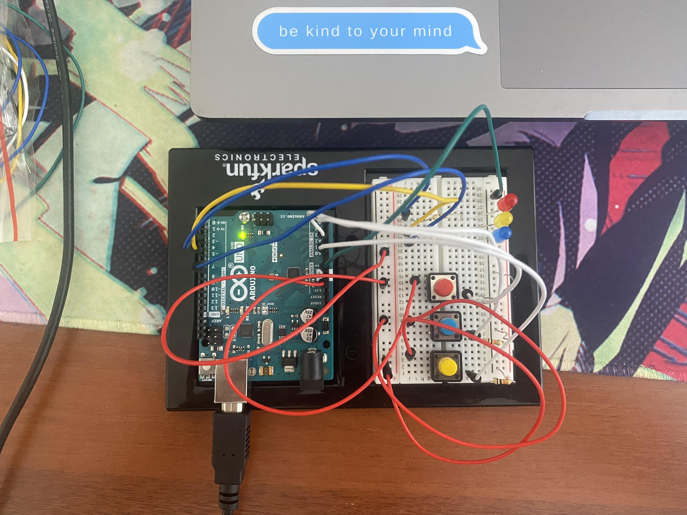
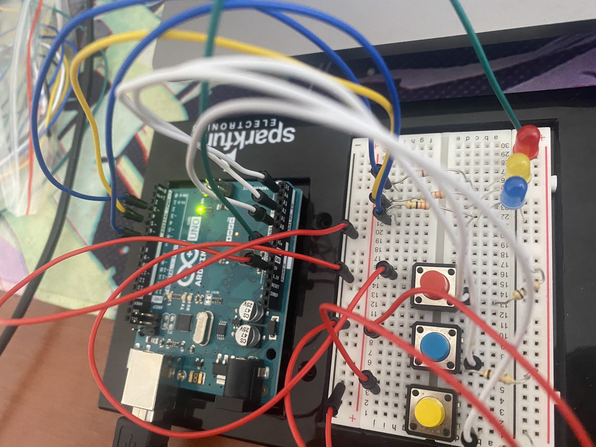

# Simon Says

Basically a programm blinks in some order with the leds and the user needs to blink in the same order by pressing the buttons. If it was made in right order, the three leds will blink at the same time. If not, they will blink one by one. 

Schematic:

Photos:

I also uploaded the video, so you can watch how the game works. You can see it <a href="https://www.youtube.com/watch?v=QMQL1bCiXjM&ab_channel=%D0%90%D0%B7%D0%B0%D0%BC%D0%B0%D1%82%D0%94%D0%B5%D1%80%D0%BC%D0%B0%D0%BD%D0%BE%D0%B2"> here. </a>
