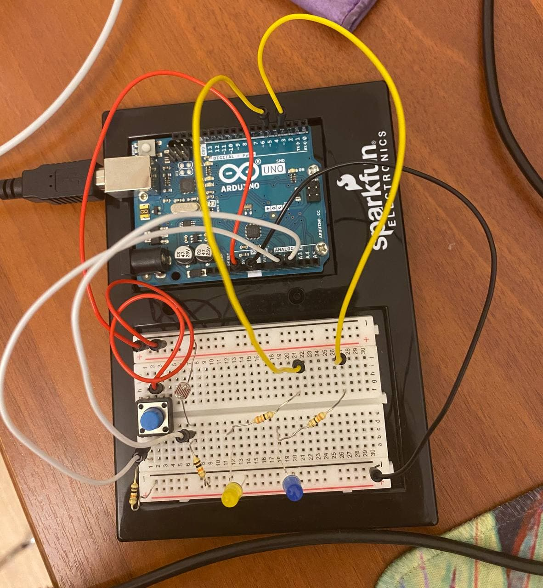

# Analog and Digital LEDs

This arduino has the light sensor, which is after some observations, constrained between 70 and 180. This was made to then, if the other LED is workig, get approximately the same 
brightness. It mostly depends on the brightness of the room, in my case, it was completely dark, except for the computer screen with arduino ide opened. There are 3 phases: rgb 0, rgb 125 and rgb 255. 

I also uploaded the video, so you can watch how the game works. You can see it <a href="https://www.youtube.com/watch?v=fwIj1wQdAnI&ab_channel=%D0%90%D0%B7%D0%B0%D0%BC%D0%B0%D1%82%D0%94%D0%B5%D1%80%D0%BC%D0%B0%D0%BD%D0%BE%D0%B2"> here. </a>
