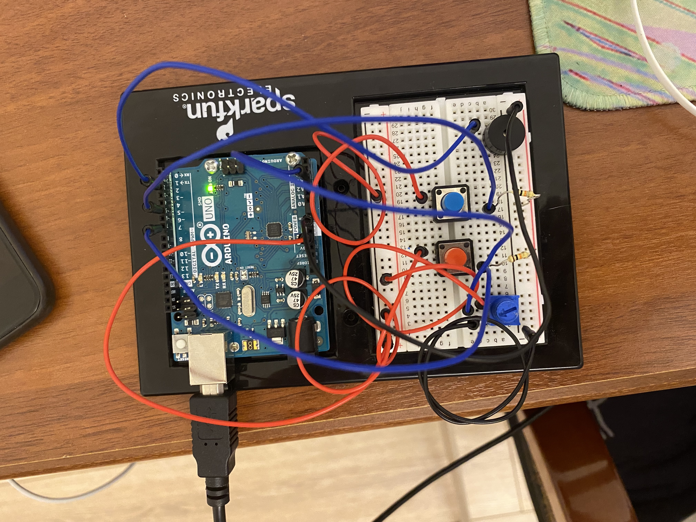

# Musical Instrument

I am not sure if it could be called a musical instrument, but it does make sounds and notes. Basically, there are always playing two notes one after another. THe buttons change the 
notes and the potentiometer changes the notes duration. You can play with that and make even some sort of a song. 

Schematic: 

Arduino:

I also uploaded the video, so you can watch how the game works. You can see it <a href="https://www.youtube.com/watch?v=LFRJDwyCKEY&ab_channel=%D0%90%D0%B7%D0%B0%D0%BC%D0%B0%D1%82%D0%94%D0%B5%D1%80%D0%BC%D0%B0%D0%BD%D0%BE%D0%B2%D0%90%D0%B7%D0%B0%D0%BC%D0%B0%D1%82%D0%94%D0%B5%D1%80%D0%BC%D0%B0%D0%BD%D0%BE%D0%B2"> here. </a>

