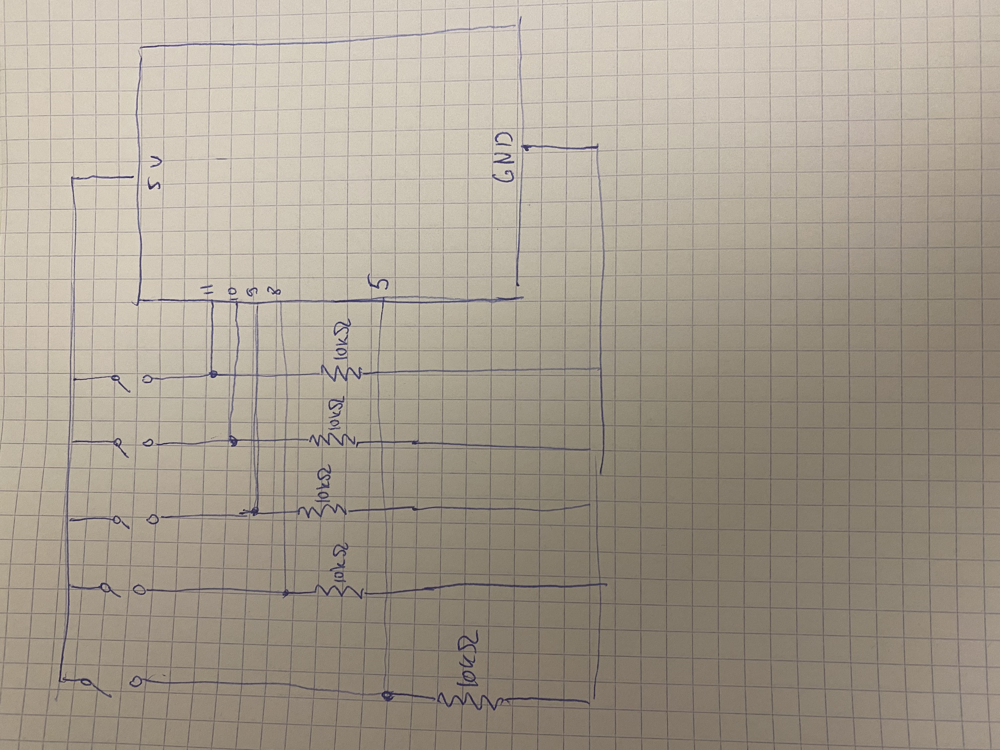
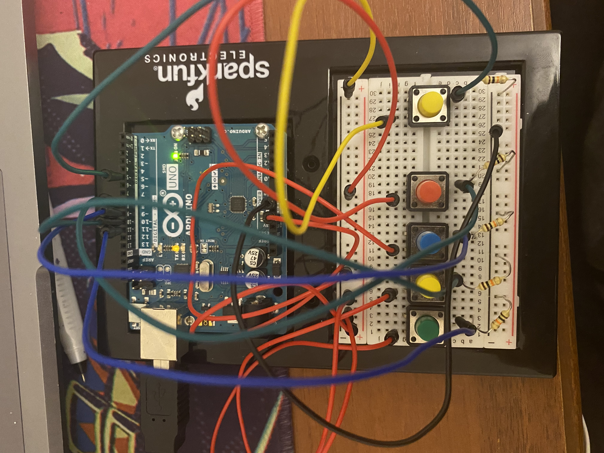

# Piano Tiles

I made a remake of the Piano Tiles game, but without the music, which I am considering to add in my final project. The main logic of the game is to press on the tile 
when it is on the edge of the screen bottom. You are pressing the tile by the arduino that has 4 buttons at the left that are corresponding to the rows of the game and a button at 
the right which is needed to start/pause and restart the game whenever you want. To quit the game, you need to press the Esc key on the keyboard. <a href = "https://www.youtube.com/watch?v=4dCwB4LComc">Here</a> is a video of how I am playing the game seen on Arduino and Processing at the same time. 

Schematic:

Arduino:

