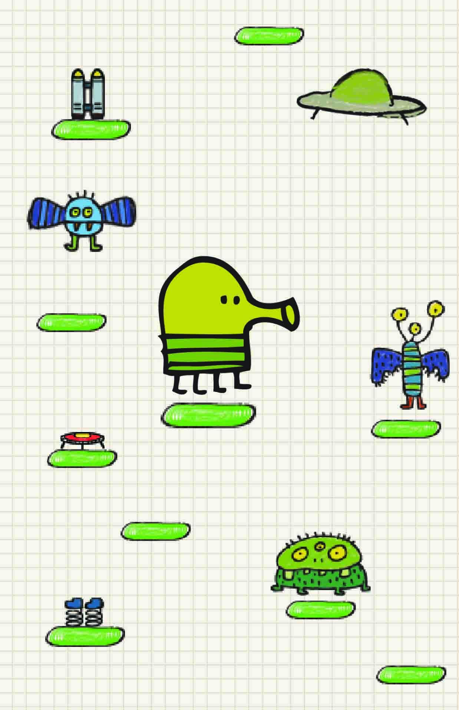

# 08.06.2021

Right now I am thinking of implementing a copy of Doodle Jump game. 

I haven't started anything, but I am thinking that it would be not as hard as it looks like. Surely, it will take some time, but I hope to implement it. 

# 09.06.2021

I looked at the gameplay of the Doodle Jump and now I can say the class that I will need.

The Doodler Class: there are only some mechanics, doodler always jumps and user change the direction of the jump to right or left. In addition, it can shoot bullets, so we 
will create another class called Bullet. The bullets are needed to kill enemies/monsters that will appear on some stages. If the doodler touches the enemies, the game ends. 

The Enemy class: just monsters spwaning at some levels of the game. Not sure if I want to add enemies that can move, so I think the enemies that just appear are good.

The Platform class: there will be 2 or 3 types of platforms: the basic ones, that just stand in space, the one that is fake, so if the doodler jumps on it, it will break and user
 will just fall. Maybe I will add the moving platform, but not sure for now. 
 
The Game class will just add everything together. So the doodler, bullets, enemies and platforms will create the game and its mechanics so everything should work fine. 

# 12.06.2021

Created the doodler class, so he can just jump on one space right now in the bottom of the screen. After that made him also jump right and left and shoot. Also used some logic of my previous project that I made in "Intro to CS" class. That game also used shooting aspect when pressed button and also the collision aspect. Therefore I tried that to implement it to this game. Even though it was written in Python, it wasn't that hard to implement into Java. After that started to work on platforms and it worked fine as it could be seen on the video below.

https://user-images.githubusercontent.com/71120362/121824640-70efea80-cccf-11eb-92c8-e6ade8b4fd53.mp4

Found the audio <a href="https://www.sounds-resource.com/mobile/doodlejump/sound/1636/" >here. </a>
